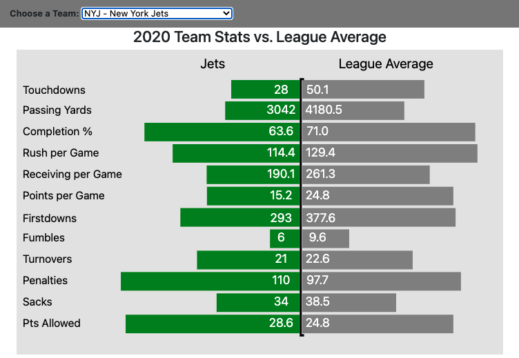
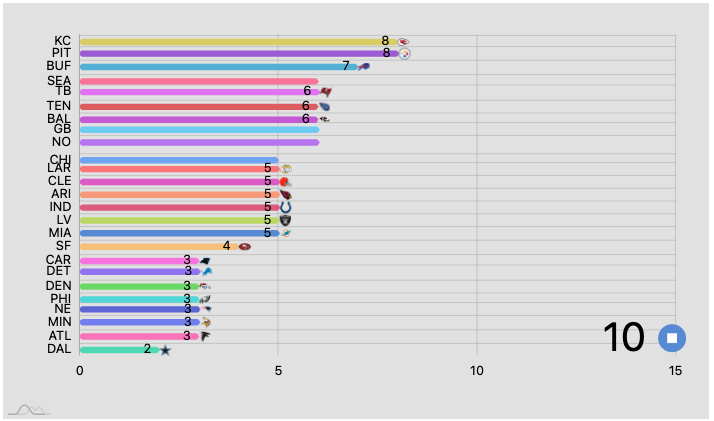
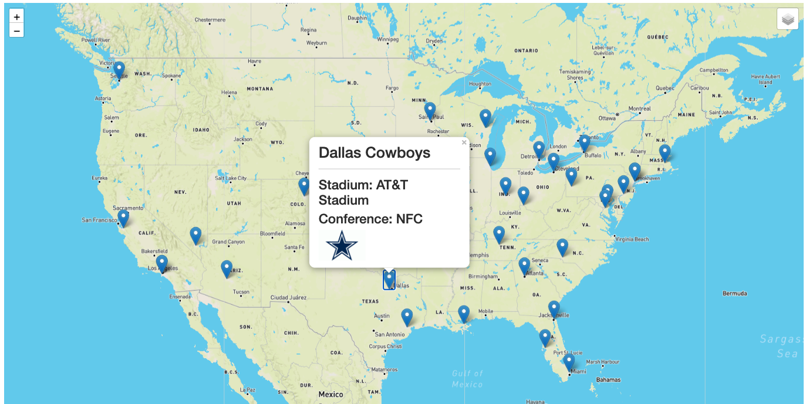

# project-2
Sports Data Visualization

Welcome to our 2020 NFL Dashboard.  Our team’s love of sports inspired us to create a dashboard that would be beneficial to the user and provide a reference point as we approach the 2021 season. The main objective was to collect data from the 2020 NFL season and provide you with an interactive experience that will provide insight and comparison from this past season. Below you will find visualizations that return team statistics, the league leaders in wins on a week to week basis and each teams 2020 season outcome. You also have access to a map with the locations for each team’s stadiums. Thank you for visiting!

Before we explain the visualizations and the methods we used to create our dashboard, I wanted to talk about our data. The data was obtained from https://sportsdata.io/. Sportsdata.io is an online API database that collects and maintains data on multiple sports. We chose to use their service since it was the most definitive API we could find that had a diverse selection of datasets for free. The datasets we chose to pull from their API are listed below and we used python and jupyter notebook to make a single request and then convert the calls into json file stored locally. Sportdata.io had a daily call limit of 100 per day, so we chose to convert the data to json so we did not accidentally exceed our call limit. 

** If you would like to run the jupyter notebook, you will have to use the requests and json libraries to run the data. Also, you will have to make an account with sportsdata.io to obtain an API key. You can enter your API key in the config.py file.

Now that we have covered the source and method to obtain the data, we will begin to describe each visualization. We will also cover the specific datasets we for our visualizations.

## Garrett Gomez-Spillane Diverging Bar Graph 2020 Team Performance vs. the League

I created the diverging bar chart seen at the top left of the visualization window. I wanted to provide someone visiting our page a snapshot of key statistics from each team. In order to build my visualization, I used the  dataset obtained from the sportsdata.io. This dataset is an array of object, with each object representing a team. For each team, sportsdata.io has collected season totals for a lot of team statistics. My first objective was to read through the dataset and pick statistics that I believed would be useful to the user. The statistics I chose were:

        [Touchdowns, Passing Yards, Completion Percentage, Rushing Yards per game, Receiving Yards per game, Points Scored, Firstdowns, Fumbles, Turnovers, Penailties, Sacks and Points Allowed]

Once I decided on the variables I wanted to include in my visualization, I had to extract them from the dataset. I used a for loop to iterate through each object and used an if statement to locate a specific object based on team abbreviation. For example, "NYJ" for the New York Jets. Inside each for loop I created a pushed each variable to a new object named teamStats (app.js line 106). 

In order to give the user something to compare the team performance to. To accomplish this, I chose to create a second object named leagueStats (app.js line 107). This object would be used as the right side of my diverging bar graph and would remain static. Since I needed to get the league averages appended to leagueStats object, I had to use a combination loops to extract the data I needed and then calculate the averages before appending to the final object. First, I used a forEach loop (app.js line 164) to iterate through each team object which stored the variables in a set of individual arrays. The next step was to use a for loop with the length 32 to loop through each array to get the total for each statistical variable. Once all the totals were calculated, I divided each total by 32 and pushed the result into the leagueStat object. 

Now that I had my both of my objects defined, I was able to construct my bar graph. I used D3 to create my diverging bar graph. The concept of my bar graph was to have 2 horizontal bar graphs that diverged away from each other from the center of the graph. The width of the bar graphs would be the values pushed to teamStats and leagueStats. 24 bars were appended individually using the chart group at different heights along the center of the graph. For the 12 bars on the right which used the data from teamStats, the width of the bars were subtracted from the center of the graph (width/2). The 12 bars on the right obtained from the leagueStats were just added to center of the graph. 

After a few adjustments to the x and y values for each bar, the graph was ready to get the ability to update the team bars based on user input. Above my graph, I included a dropdown box with all 32 NFL teams. Then I created an event listener using the values from the drop down value to update the team bars using the create bar function. I wrapped my entire diverging bar graph inside of the create bar function. This gives the graph the ability to update.

## TEJAS PATEL BAR RACE CHART

In This Project, We have build an interactive dasboard to explore the NFL Team wins stats.

The dataset reveals total 32 team wins through week 1 through 17 display on race bar chart.
## Step 1: Read dataset and cleaning

    1.  we have used D3 library to read NFL Score json file.
    2.  we use for loop to collect Array of teams and wins per weeks.
## Step 2: AmCharts

    1. use AmCharts to display race chart with image display.
        * y axis display 'Team Abbr'
        * X axis display 'Win score per week'
        * click button to stop for specific week. 
    2. Chart will update every week score for each teams.

## MIKE TYBURCZY BUBBLE GRAPH

For this chart, we used D3 to create a categorized bubble chart.  To get all of the data needed, we combined two of the JSON files pulled from the API and added a column with the logo URLs using pandas and then read it into the app.js file as a CSV.  The default view shows all 32 NFL teams in one cluster with the logo size corresponding to the number of wins each team had in the 2020 season.  You can see the difference in size between the Jaguars who had 1 win and the Chiefs who had 14. To get the logos into the circles we appended the image url to pattern and def tags and then used the fill style to fill the circles with images instead of colors.  You can use the buttons in the top left to view the chart categorized by conference and then also by Division.  We also added the Tool Tip to the visualization showing additional season stats such as wins, score, points allowed, time of possession, penalty yards, and turnover differential.  The Tool Tip shows when a logo is clicked and hides when you mouseover anywhere else within the SVG. 

## NFL STADIUM LOCATIONS - GeoJSON of American Football Stadiums (HARRY BONSU)

With geojson data retrieved from https://github.com/sisskind/GeoJSON-Football/blob/master/stadiums.geojson, we used the capababilities of Leaflet to create a map to show the locations of all current NFL stadiums. However, since the data was last updateed in 2017, a local copy was created and updated to reflect the current information on the teams as well as the stadiums. An image folder containing all the logos of the NFL teams was used to add team logos to the popups on the maps. Users will notice that teams which share stadiums such as L.A. Rams and L.A. Chargers (SoFi Stadium) and NY Jets and NY Giants (MetLife Stadium) have the logos of both teams in their respective popups. 

The map has three (3) base layers; Street, Dark and Satelite Map. With a collapsable control panel, users can pick which layer they want to view. The popups show important information on the team/teams that play in these stadiums, Stadium name, Conference as well as the Team logo. 

## DAVID THOMPSON SUNBURST CHART

Sunburst Chart — also known as Ring Chart, Multi-level Pie Chart, and Radial Treemap — is typically used to visualize hierarchical data structures.

A Sunburst Chart consists of an inner circle surrounded by rings of deeper hierarchy levels. The angle of each segment is either proportional to a value or divided equally under its parent node.

All segments in Sunburst Charts may be colored according to which category or hierarchy level they belong to.

The example file show the sunbrust chart
I used SunburstNFL to generated the required json file for the sunbrust
The FlaskFetch shows the flask connected with Python together to grab data from json file and display on a url